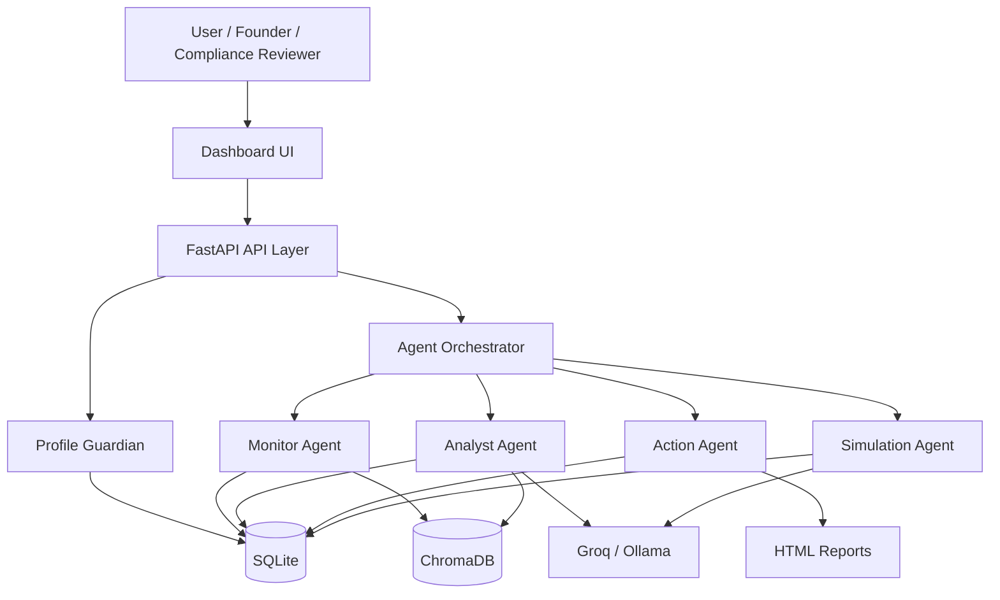

# ComplianceOS

**Agentic compliance intelligence for Indian MSMEs and FinTechs**

ComplianceOS is a multi-agent regulatory intelligence platform. It helps Indian MSMEs, digital-first businesses, and fintech operators understand what compliance obligations apply to them, why those obligations matter, what action to take next, and how future growth changes their regulatory exposure.

Instead of acting like a generic chatbot, ComplianceOS behaves like a focused compliance operating system:
- it captures a structured business profile
- maps that profile against deterministic compliance rules
- enriches findings with regulatory retrieval and LLM explanations
- turns obligations into actionable steps and alerts
- simulates "what changes if turnover or business model changes?"
- records every important decision in an auditable trail

The result is a practical compliance co-pilot for businesses that cannot afford a full legal and regulatory team, but still face real risk from GST, RBI, MSME, MCA, labour, and related obligations

## Problem

Indian MSMEs face compliance obligations across GST, RBI, MSME, MCA, labour, and sector-specific rules. In fintech, the problem becomes even harder:

- one change in turnover can trigger new GST obligations
- one product change can trigger RBI digital lending requirements
- one missed filing can affect cash flow, trust, funding readiness, or regulatory posture
- most small teams do not have an in-house compliance function

This creates a painful gap between regulation and execution. Businesses often know they should be compliant, but they do not know:

- what exactly applies to them
- what changed recently
- what to do first
- what happens when they scale

## Solution

ComplianceOS turns compliance into a structured, explainable workflow:

- business profile in
- deterministic rule engine checks applicable obligations
- retrieval layer brings relevant regulatory context
- LLM layer converts complexity into usable summaries
- action engine creates tasks, escalations, and alerts
- simulation engine shows what changes under future scenarios

The goal is simple:

> help an MSME or fintech understand what applies, why it matters, what to do next, and what to plan before growth creates new risk.

## Why This Is Stronger Than a Normal AI Assistant

ComplianceOS designed as a **hybrid agentic system**, not a pure LLM workflow.

- the compliance trigger logic is **deterministic**
- the retrieval layer adds **grounding and context**
- the LLM is used for **explanation and prioritization**
- the agents create a **real operational pipeline**, not just a chat response

This matters because compliance is a trust-heavy domain. I do not want the model inventing obligations. The model helps explain; the rule engine decides.

## Agentic Workflow

ComplianceOS is organized into five focused agents:

### 1. Profile Guardian
- validates inputs
- detects profile inconsistencies
- derives MSME classification
- stores a versioned business profile

### 2. Monitor Agent
- checks recent regulatory updates
- creates alerts for affected businesses
- initializes the regulatory retrieval corpus

### 3. Analyst Agent
- runs the deterministic threshold engine
- retrieves relevant regulatory clauses
- computes risk score and penalty exposure
- generates executive summary and top-priority narrative

### 4. Action Agent
- converts obligations into action items
- flags escalation-worthy issues
- creates alerts
- generates a downloadable compliance report

### 5. Simulation Agent
- runs what-if analysis on turnover or business-model changes
- shows new obligations before thresholds are crossed
- estimates future risk and penalty exposure

## Key Features

- **Profile-aware compliance analysis** for MSMEs and fintechs
- **Deterministic threshold engine** backed by seeded regulatory rules
- **RAG-powered grounding** using a local ChromaDB corpus
- **Risk scoring** with regulator-wise breakdown and penalty exposure
- **Action plan generation** with urgency and human-approval signals
- **Scenario simulation** for proactive compliance planning
- **Audit trail and session history** for explainability
- **Dashboard UI and downloadable reports** for usability

## High-Level Architecture



## Technology Stack

The project combines:

- **FastAPI** for the API layer
- **SQLite** for persistent business state, obligations, alerts, sessions, and audit logs
- **ChromaDB** for semantic retrieval over regulatory content
- **sentence-transformers** for embeddings
- **Groq / Ollama** for LLM-backed summaries and narratives
- **HTML/CSS/JavaScript dashboard** for the front-end experience

The underlying schema is designed for:

- versioned business profiles
- rule-driven obligation detection
- immutable audit events
- risk history over time
- generated reports and alerts

## What Works in the Current MVP

The current prototype already includes:

- a working FastAPI application
- a complete dashboard UI
- seeded compliance rules across GST, RBI, MSME, MCA, PF/ESI, and SEBI
- a multi-agent analysis pipeline
- risk scoring and penalty estimation
- action-item and alert generation
- scenario simulation
- downloadable HTML reports

## Running the Project

```bash
pip install -r requirements.txt
uvicorn main:app --reload --port 8000
```

Open:

```text
http://localhost:8000
```

Set `.env` with:

```env
GROQ_API_KEY=your_groq_api_key
GROQ_MODEL=llama-3.3-70b-versatile
```

## More Detail

For the full build story, design decisions, MVP scope, implementation narrative, and roadmap, see [development.md]

## Conclusion

ComplianceOS is my attempt to make compliance proactive, explainable, and usable for Indian MSMEs and fintechs. The project is not just a chatbot for regulations. It is a structured agentic system that combines rules, retrieval, reasoning, and action planning into one workflow.

If the core question is:

> "What does this business need to do to stay compliant as it grows?"

ComplianceOS is the system I built to answer that clearly.
